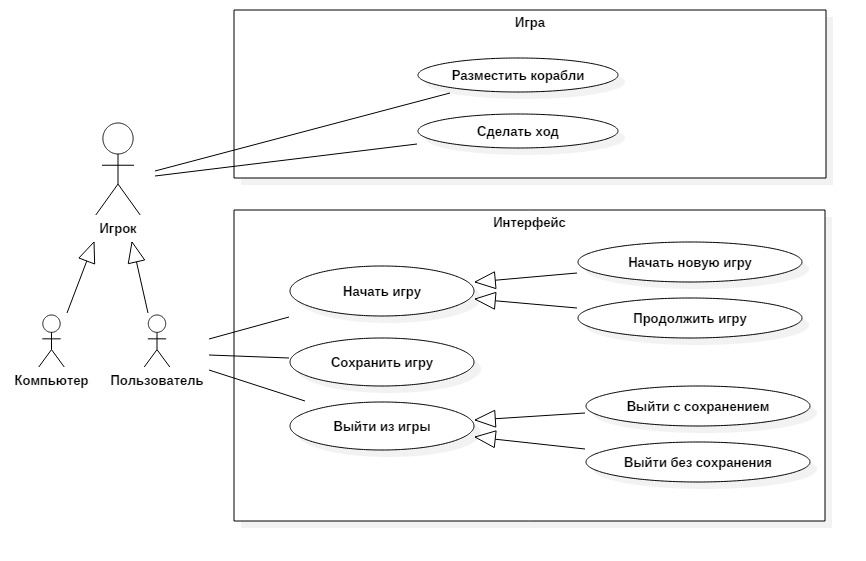
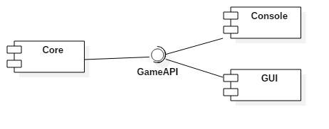

# Морской бой
## Задание

Реализовать проект "Морской бой", предполагающий игру двух партнеров по базовым правилам.

## Концепция (vision statement)

Готовый проект подразумевает участие человека и компьютера и обладает графическим интерфейсом. Игра ведется по стандартным правилам. Пользователю дается возможность сохранения текущей игры и загрузки незавершенных партий. 

### Правила игры

Поле каждого игрока представляет собой квадрат 10х10, на котором размещаются корабли. Поле содержит числовые и буквенные координаты (по вертикали числа 1-10, а по горизонтали буквы от а до к).  Для классической игры используются 4 однопалубных корабля, 3 двупалубных, 2 трехпалубных и 1 четырехпалубный корабль. Их размещают внутри игрового поля. По правилам, корабли не должны соприкасаться. Размещать корабли можно как горизонтально, так и вертикально.

Рядом со своим полем игрок видит поле противника, где крестиком отмечает попадания по чужим кораблям. Попавший игрок делает ещё один ход.

### Нарушения 

* Количество кораблей не соответствует правилам; 
* Корабли расположены вплотную друг к другу; 
* Изменён размер поля;
* Указаны неправильные координаты. 

### Процесс игры 

* Игрок, выполняющий ход, называет координату, на которой, по его мнению, располагается корабль соперника. Например, А1;
* При промахе игрок получает сообщение «Мимо!», при попадании «Ранил» или «Убил»;
* Игра продолжается до потопления всех кораблей одного из игроков.

## Минимально работоспособный продукт (Minimum viable product)

Консольное приложение, созданное для игры двух соперников в "Морской бой".

## Диаграмма прецедентов использования

## Диаграмма последовательностей

## Диаграмма компонентов

