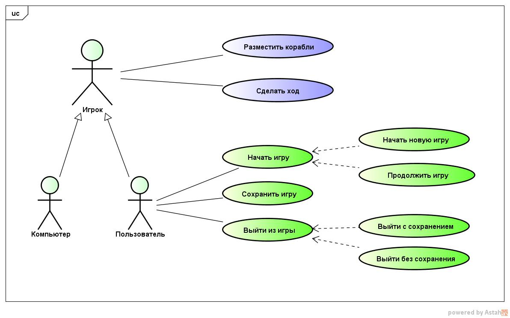

# Морской бой
## Задание

Реализовать проект "Морской бой", предполагающий игру двух партнеров по базовым правилам.

## Концепция (vision statement)

Готовый проект подразумевает участие человека и компьютера или двух человек и обладает графическим интерфейсом. Игра ведется по стандартным правилам. Пользователю дается возможность сохранения текущей игры и загрузки незавершенных партий. 

## Минимально работоспособный продукт (Minimum viable product)

https://en.wikipedia.org/wiki/Minimum_viable_product

## Диаграмма прецедентов использования

## Диаграмма последовательностей

## Диаграмма компонентов
